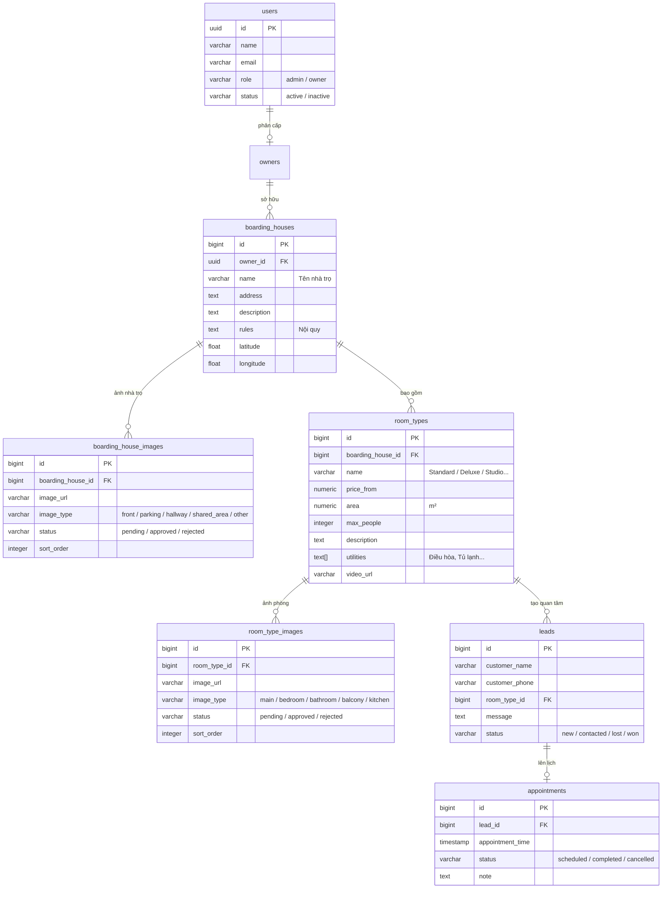
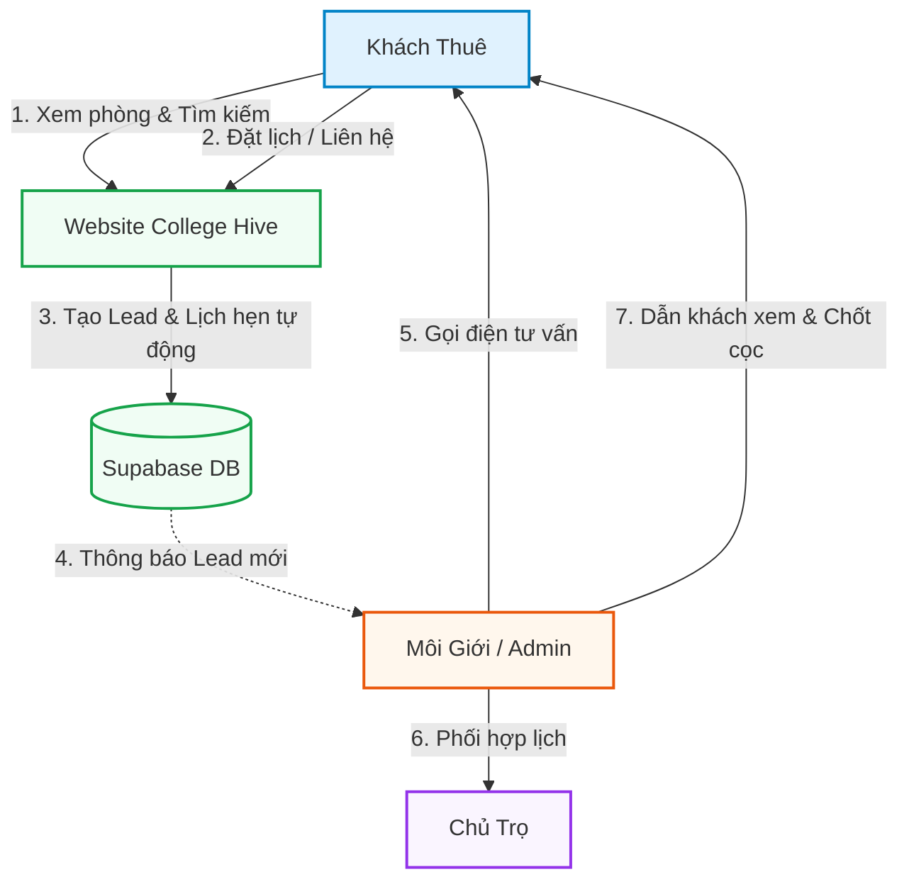

# 🏠 COLLEGE HIVE — HỆ THỐNG MÔI GIỚI PHÒNG TRỌ HÒA LẠC

> **Giải pháp tối ưu hóa quy trình kết nối Khách thuê · Môi giới · Chủ trọ chuyên nghiệp.**  
> Nền tảng được xây dựng riêng cho đội ngũ môi giới, tập trung khai thác nguồn hàng từ chủ nhà, tối ưu hiển thị và quản lý khách hàng tiềm năng (Leads) để tối đa hóa tỷ lệ chốt phòng.

---

## 📌 1. Tổng Quan Hệ Thống

Trong thị trường cho thuê phòng trọ truyền thống, thông tin thường bị phân tán, hình ảnh thiếu thực tế và quy trình liên lạc chồng chéo. Hệ thống này được xây dựng theo triết lý **"Tập trung hóa dịch vụ qua Môi giới"**:

- **Nguồn hàng đa dạng:** Tập hợp phòng trọ chất lượng cao từ nhiều chủ trọ.
- **Hình ảnh & Trải nghiệm Premium:** Danh mục phòng hiển thị đẹp mắt, hỗ trợ ảnh độ nét cao, video thực tế, bản đồ POI tương tác.
- **Bảo mật nguồn hàng & Khách hàng:** Khách thuê chỉ làm việc duy nhất với Môi giới.
- **Vận hành tự động:** Tự động tạo Lead, lên lịch hẹn xem phòng.

---

## 🎨 2. Nhận Diện Thương Hiệu & Thiết Kế UI

Hệ thống tuân theo ngôn ngữ thiết kế **Navy & White** hiện đại, sang trọng:

| Yếu tố | Giá trị | Ứng dụng |
| :--- | :--- | :--- |
| **Màu chủ đạo** | Navy Blue `#000080` | Nút CTA, badge, icon nhấn mạnh |
| **Màu nền** | White `#FFFFFF` & Slate `#F8FAFC` | Nền trang, thẻ card, bảng thông tin |
| **Typography** | `Inter`, `Outfit` | Phông chữ hiện đại, sắc nét trên mọi thiết bị |
| **Bo góc** | `rounded-[1.8rem]` đến `rounded-[2.5rem]` | Card, modal, badge — phong cách mềm mại |

---

## 🏗️ 3. Kiến Trúc & Công Nghệ

| Thành phần | Công nghệ |
| :--- | :--- |
| **Framework** | Next.js 16 (App Router, Turbopack) |
| **Ngôn ngữ** | TypeScript |
| **Styling** | Tailwind CSS v4 |
| **UI Components** | shadcn/ui |
| **Database** | Supabase (PostgreSQL) + LocalStorage Fallback |
| **Auth** | Supabase Auth |
| **Icon** | Lucide React |
| **Deploy** | Vercel (khuyến nghị) |

### Cơ chế Database thông minh
Hệ thống tự động chuyển đổi giữa **Supabase** (khi có kết nối) và **LocalStorage** (khi offline hoặc chưa cấu hình), đảm bảo luôn hoạt động với dữ liệu seed đầy đủ — không cần cấu hình gì thêm khi chạy local.

---

## 🗂️ 4. Cấu Trúc Thư Mục Dự Án

```
THUETROHOALAC/
├── public/
│   └── doodle_divider.png          # Hình trang trí hand-drawn
│
├── src/
│   ├── app/
│   │   ├── page.tsx                # Trang chủ (2 tab: Nhà trọ / Kiểu phòng)
│   │   ├── rooms/
│   │   │   ├── page.tsx            # Danh sách tất cả phòng
│   │   │   └── [id]/page.tsx       # Chi tiết kiểu phòng + đặt lịch
│   │   ├── boarding-house/
│   │   │   └── [id]/page.tsx       # Chi tiết nhà trọ (bento gallery)
│   │   ├── admin/
│   │   │   ├── page.tsx            # Dashboard admin
│   │   │   ├── login/page.tsx      # Đăng nhập admin
│   │   │   ├── rooms/
│   │   │   │   ├── new/page.tsx    # Thêm kiểu phòng mới
│   │   │   │   └── [id]/edit/      # Chỉnh sửa kiểu phòng
│   │   │   └── poi/page.tsx        # Quản lý điểm POI bản đồ
│   │   ├── owner/page.tsx          # Dashboard chủ trọ
│   │   ├── about/page.tsx          # Giới thiệu
│   │   └── docs/[slug]/page.tsx    # Trang tài liệu markdown
│   │
│   ├── components/
│   │   ├── boarding-house-card.tsx # Thẻ nhà trọ (trang chủ tab Nhà trọ)
│   │   ├── room-type-card.tsx      # Thẻ kiểu phòng (trang chủ tab Kiểu phòng)
│   │   ├── header.tsx              # Header sticky với thanh tìm kiếm
│   │   └── ui/                     # shadcn/ui components
│   │
│   └── lib/
│       ├── db.ts                   # Unified DB service (Supabase + LocalStorage)
│       └── supabase.ts             # Supabase client + TypeScript interfaces
```

---

## 🖥️ 5. Luồng Người Dùng (User Flows)

### Khách thuê (Guest)
```
Trang chủ
  ├── Tab "Nhà trọ" (mặc định)
  │     └── Click thẻ nhà trọ
  │           └── /rooms/[id]  ←── Trang chi tiết phòng đầu tiên trong nhà trọ
  │                 ├── Sidebar: Danh sách kiểu phòng + GIÁ (chuyển tab ngay)
  │                 ├── Gallery ảnh (bento 1 lớn + 4 nhỏ) + Lightbox xem tất cả
  │                 ├── Video thực tế (YouTube embed)
  │                 ├── Tiện nghi & Thông tin tòa nhà
  │                 └── Form đặt lịch / Gọi điện trực tiếp
  │
  └── Tab "Kiểu phòng"
        └── Click thẻ phòng bất kỳ
              └── /rooms/[id]  (giống trên)
```

### Môi giới / Admin
```
/admin/login  →  /admin (Dashboard)
  ├── Thống kê: Leads mới, lịch hẹn hôm nay, tổng nhà trọ, phòng trống
  ├── Quản lý Leads → Cập nhật trạng thái (new/contacted/won/lost)
  ├── Quản lý Lịch hẹn → Ghi chú, xác nhận, hủy
  ├── Quản lý Nhà trọ & Kiểu phòng → CRUD đầy đủ
  ├── Duyệt ảnh → Approve/Reject ảnh từ chủ trọ
  └── Quản lý POI bản đồ
```

### Chủ trọ (Owner)
```
/owner (Dashboard)
  ├── Danh sách nhà trọ của mình
  ├── Thêm/Sửa kiểu phòng, cập nhật giá
  └── Upload ảnh → Gửi chờ Môi giới duyệt
```

---

## 🗄️ 6. Kiến Trúc Cơ Sở Dữ Liệu



---

## 🔄 7. Mô Hình Hoạt Động



---

## 👥 8. Phân Quyền Người Dùng

### 🔑 Admin (Môi giới)
- Toàn quyền quản trị hệ thống
- Duyệt / từ chối ảnh từ chủ trọ
- Xem & xử lý tất cả Leads + Lịch hẹn
- Dashboard thống kê tổng quan

### 🏠 Owner (Chủ trọ)
- Quản lý nhà trọ & kiểu phòng **của chính mình**
- Upload ảnh → chờ Môi giới duyệt
- 🛑 **Không** xem thông tin khách hàng (Leads)
- 🛑 **Không** quản lý lịch hẹn
- 🛑 **Không** xem dữ liệu chủ trọ khác

### 👤 Khách thuê (Guest)
- Không cần đăng ký tài khoản
- Tìm kiếm, lọc, xem phòng tự do
- Gửi yêu cầu đặt lịch xem phòng

---

## ✨ 9. Cập Nhật & Thay Đổi Hôm Nay (01/06/2026)

### 🏠 Trang chủ — 2 Tab mới
Trang chủ được thiết kế lại với **2 tab rõ ràng**:

| Tab | Nội dung | Mô tả |
| :--- | :--- | :--- |
| 🏢 **Nhà trọ** | Thẻ các nhà trọ | Mục chính — xem theo nhà trọ, click vào xem các kiểu phòng bên trong |
| ⊞ **Kiểu phòng** | Tất cả kiểu phòng | Lướt xem toàn bộ các kiểu phòng của mọi nhà trọ |

- Mỗi tab hiển thị **số lượng** tương ứng, tô màu Navy Blue khi active.
- Bộ lọc **Giới tính · Tiện nghi · Khoảng giá** dùng chung cho cả 2 tab.
- Tab **Kiểu phòng** có thêm bộ lọc **Kiểu** (Standard / Deluxe / Studio / Gác lửng).

### 🃏 Component `BoardingHouseCard`
Thẻ nhà trọ mới được tạo (`src/components/boarding-house-card.tsx`) hiển thị:
- Ảnh mặt tiền nhà trọ (portrait `3:4`)
- Badge **số kiểu phòng** (Navy Blue, top-left)
- Badge **rating** (top-right)
- Tên nhà trọ, địa chỉ rút gọn
- Giá từ (giá rẻ nhất trong nhà trọ)
- Click → vào thẳng `/rooms/[firstRoomId]` (kiểu phòng đầu tiên)

### 🖼️ Trang chi tiết nhà trọ — Bento Gallery (`/boarding-house/[id]`)
Trang mới với gallery kiểu Airbnb:
```
┌──────────────┬──────┬──────┐
│              │  #2  │  #3  │
│     #1       ├──────┼──────┤
│  (ảnh lớn)  │  #4  │  #5  │
└──────────────┴──────┴──────┘
                  [📸 Xem tất cả X ảnh]
```
- Click bất kỳ ảnh → **Lightbox toàn màn hình** với thumbnail strip + điều hướng mũi tên.
- Hiển thị overlay `+N ảnh` nếu có nhiều hơn 5 ảnh.

### 🎯 Sidebar kiểu phòng — Giá hiển thị rõ ràng
Tại trang `/rooms/[id]`, sidebar **"Danh sách kiểu phòng"** đã hiển thị:
- Tên phòng (ví dụ: *Phòng Standard*)
- **Giá ngay bên dưới** (ví dụ: *2,800,000đ*)
- Phòng đang xem: nền Navy Blue nổi bật
- Click phòng khác → chuyển trang ngay lập tức

### 🎨 Hình trang trí doodle
- Tạo hình nét vẽ tay hand-drawn (`public/doodle_divider.png`)
- Đặt giữa lưới phòng và phần khám phá bên dưới trang chủ

---

## 🚀 10. Hướng Dẫn Cài Đặt & Chạy Dự Án

### Yêu cầu hệ thống
- Node.js >= 18.0.0
- npm hoặc yarn

### Khởi động nhanh

```bash
# 1. Cài đặt thư viện
npm install

# 2. Cấu hình biến môi trường (tuỳ chọn — hệ thống tự dùng LocalStorage nếu bỏ qua)
cp .env.example .env.local
# Điền NEXT_PUBLIC_SUPABASE_URL và NEXT_PUBLIC_SUPABASE_ANON_KEY

# 3. Chạy ở chế độ phát triển
npm run dev
```

Mở trình duyệt tại: [http://localhost:3000](http://localhost:3000)

### Cấu hình Supabase (tuỳ chọn)

```env
NEXT_PUBLIC_SUPABASE_URL=https://your-project.supabase.co
NEXT_PUBLIC_SUPABASE_ANON_KEY=your-anon-key
```

> **Lưu ý:** Nếu không cấu hình Supabase, hệ thống tự động sử dụng **LocalStorage** với dữ liệu seed đầy đủ (4 nhà trọ, 9 kiểu phòng, ảnh Unsplash). Không cần setup gì thêm.

### Tạo Database trên Supabase
Vào **SQL Editor** trên Supabase Dashboard, copy nội dung file `DATABASE_SCHEMA.sql` và nhấn **Run**.

---

## 📋 11. Quy Chuẩn Ảnh & Hiệu Suất

| Trang | Số ảnh tải lần đầu | Ghi chú |
| :--- | :--- | :--- |
| Trang chủ — Tab Nhà trọ | 1 ảnh/thẻ nhà trọ | Ảnh mặt tiền (front) |
| Trang chủ — Tab Kiểu phòng | 1 ảnh/thẻ phòng | Ảnh main của kiểu phòng |
| Chi tiết kiểu phòng | 5 ảnh (bento grid) | Lightbox lazy load phần còn lại |
| Chi tiết nhà trọ | 5 ảnh (bento grid) | Lightbox lazy load phần còn lại |

**Tiêu chuẩn định dạng:** AVIF > WebP > JPG  
**Kỹ thuật:** `loading="lazy"` cho ảnh below-the-fold, `fetchpriority="high"` cho ảnh hero.

---

*Hệ thống được phát triển và vận hành bởi đội ngũ **Sale Hùng**. Mọi đóng góp hoặc báo lỗi vui lòng tạo Issue trên repository.*